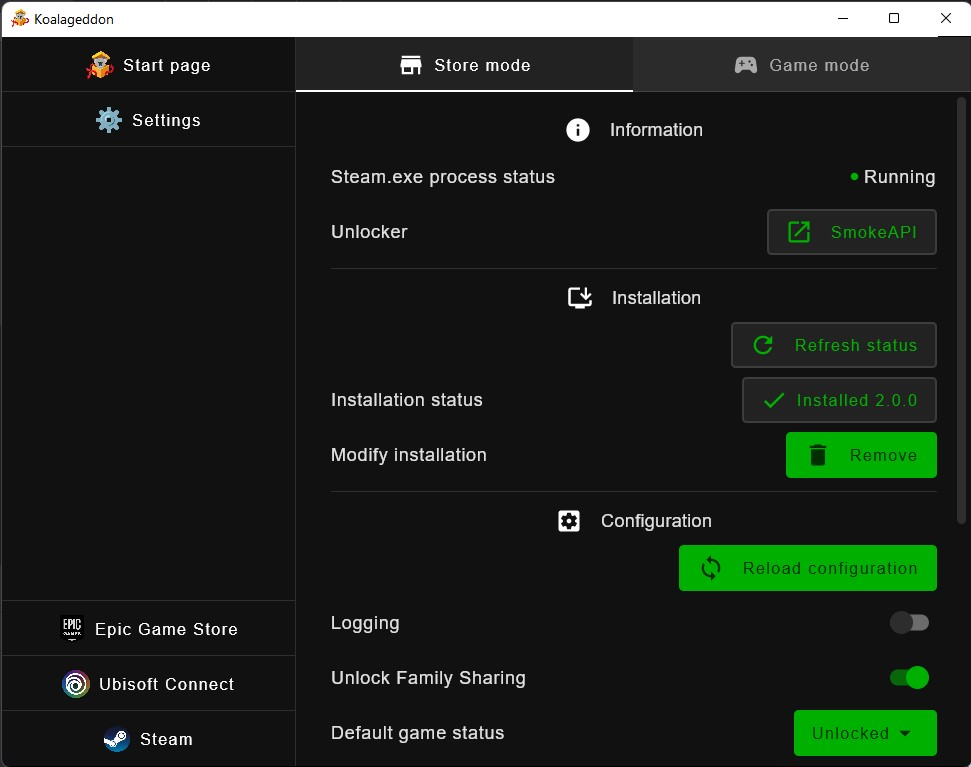

= 🐨 Koalageddon 💥 v2

image::src/jvmMain/resources/images/icon.png[,256]

A multi-store DLC unlocker.
Currently, in development.

*https://cs.rin.ru/forum/viewtopic.php?p=2758149#p2758149[Announcement post]*

Implemented stores:

* _Steam_ via SmokeAPI (store mode)

Coming up in future updates:

* _Steam_ via SmokeAPI (game mode)
* _Epic Games Store_ via ScreamAPI (store mode)
* _Epic Games Store_ via ScreamAPI (game mode)
* _Ubisoft Connect_ via UplayR*Unlocker (store mode)
* _Ubisoft Connect_ via UplayR*Unlocker (game mode)

== 🏗️ Development setup

=== 🚦 Requirements

* Java Development Kit (JDK)
** Minimum version: `11`. https://docs.aws.amazon.com/corretto/latest/corretto-11-ug/windows-7-install.html[Download].
** Release build version: `17`. https://www.oracle.com/java/technologies/downloads/#java17[Download].

=== 👨‍💻 Commands

Build the project:

----
.\gradlew.bat createDistributable
----

This command will write the build directory in the console output.

=== 🌐 Translation

* User strings are defined in link:src/jvmMain/kotlin/acidicoala/koalageddon/core/values/Strings.kt[Strings.kt]
* Languages are defined in link:src/jvmMain/kotlin/acidicoala/koalageddon/core/model/Settings.kt[Settings.kt]

== 📄 License

This software is licensed under the https://unlicense.org/[Unlicense], terms of which are available in link:UNLICENSE.txt[UNLICENSE.txt]